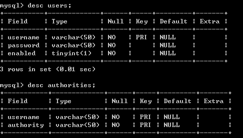
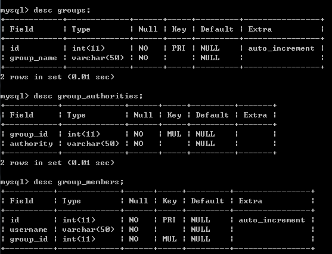

# AuthenticationProvider

认证是由 AuthenticationManager 来管理的，但是真正进行认证的是 AuthenticationManager 中定义的 AuthenticationProvider。AuthenticationManager 中可以定义有多个 AuthenticationProvider。当我们使用 authentication-provider 元素来定义一个 AuthenticationProvider 时，如果没有指定对应关联的 AuthenticationProvider 对象，Spring Security 默认会使用 DaoAuthenticationProvider。DaoAuthenticationProvider 在进行认证的时候需要一个 UserDetailsService 来获取用户的信息 UserDetails，其中包括用户名、密码和所拥有的权限等。所以如果我们需要改变认证的方式，我们可以实现自己的 AuthenticationProvider；如果需要改变认证的用户信息来源，我们可以实现 UserDetailsService。
 
实现了自己的 AuthenticationProvider 之后，我们可以在配置文件中这样配置来使用我们自己的 AuthenticationProvider。其中 myAuthenticationProvider 就是我们自己的 AuthenticationProvider 实现类对应的 bean。

```
   <security:authentication-manager>
      <security:authentication-provider ref="myAuthenticationProvider"/>
   </security:authentication-manager>
```

实现了自己的 UserDetailsService 之后，我们可以在配置文件中这样配置来使用我们自己的 UserDetailsService。其中的 myUserDetailsService 就是我们自己的 UserDetailsService 实现类对应的 bean。

```
   <security:authentication-manager>
      <security:authentication-provider user-service-ref="myUserDetailsService"/>
   </security:authentication-manager>
```

## 用户信息从数据库获取

通常我们的用户信息都不会向第一节示例中那样简单的写在配置文件中，而是从其它存储位置获取，比如数据库。根据之前的介绍我们知道用户信息是通过 UserDetailsService 获取的，要从数据库获取用户信息，我们就需要实现自己的 UserDetailsService。幸运的是像这种常用的方式 Spring Security 已经为我们做了实现了。
 
### 使用 jdbc-user-service 获取

在 Spring Security 的命名空间中在 authentication-provider 下定义了一个 jdbc-user-service 元素，通过该元素我们可以定义一个从数据库获取 UserDetails 的 UserDetailsService。jdbc-user-service 需要接收一个数据源的引用。

```
   <security:authentication-manager>
      <security:authentication-provider>
         <security:jdbc-user-service data-source-ref="dataSource"/>      
      </security:authentication-provider>
   </security:authentication-manager>
```

上述配置中 dataSource 是对应数据源配置的 bean 引用。使用此种方式需要我们的数据库拥有如下表和表结构。


 


这是因为默认情况下 jdbc-user-service 将使用 SQL 语句 “select username, password, enabled from users where username = ?” 来获取用户信息；使用 SQL 语句 “select username, authority from authorities where username = ?” 来获取用户对应的权限；使用 SQL 语句 “select g.id, g.group_name, ga.authority from groups g, group_members gm, group_authorities ga where gm.username = ? and g.id = ga.group_id and g.id = gm.group_id” 来获取用户所属组的权限。需要注意的是 jdbc-user-service 定义是不支持用户组权限的，所以使用 jdbc-user-service 时用户组相关表也是可以不定义的。如果需要使用用户组权限请使用 JdbcDaoImpl，这个在后文后讲到。

当然这只是默认配置及默认的表结构。如果我们的表名或者表结构跟 Spring Security 默认的不一样，我们可以通过以下几个属性来定义我们自己查询用户信息、用户权限和用户组权限的 SQL。

<table>
<tr>
<td><strong>属性名</strong></td>
<td><strong>说明</strong></td>
</tr>
<tr>
<td> users-by-username-query</td>
<td> 指定查询用户信息的 SQL</td>
</tr>
<tr>
<td>authorities-by-username-query</td>
<td>指定查询用户权限的 SQL</td>
</tr>
<tr>
<td>group-authorities-by-username-query</td>
<td>指定查询用户组权限的 SQL</td>
</tr>
</table>
 
假设我们的用户表是 t\_user，而不是默认的 users，则我们可以通过属性 users-by-username-query 来指定查询用户信息的时候是从用户表 t\_user 查询。

```
   <security:authentication-manager>
      <security:authentication-provider>
         <security:jdbc-user-service
            data-source-ref="dataSource"
            users-by-username-query="select username, password, enabled from t_user where username = ?" />
      </security:authentication-provider>
   </security:authentication-manager>
```

#### role-prefix 属性

jdbc-user-service 还有一个属性 role-prefix 可以用来指定角色的前缀。这是什么意思呢？这表示我们从库里面查询出来的权限需要加上什么样的前缀。举个例子，假设我们库里面存放的权限都是 “USER”，而我们指定了某个 URL 的访问权限 access=”ROLE_USER”，显然这是不匹配的，Spring Security 不会给我们放行，通过指定 jdbc-user-service 的 role-prefix=”ROLE\_” 之后就会满足了。当 role-prefix 的值为 “none” 时表示没有前缀，当然默认也是没有的。
 
### 直接使用 JdbcDaoImpl

JdbcDaoImpl 是 UserDetailsService 的一个实现。其用法和 jdbc-user-service 类似，只是我们需要把它定义为一个 bean，然后通过 authentication-provider 的 user-service-ref 进行引用。

```
   <security:authentication-manager>
      <security:authentication-provider user-service-ref="userDetailsService"/>
   </security:authentication-manager>
  
   <bean id="userDetailsService" class="org.springframework.security.core.userdetails.jdbc.JdbcDaoImpl">
      <property name="dataSource" ref="dataSource"/>
   </bean>
```

如你所见，JdbcDaoImpl 同样需要一个 dataSource 的引用。如果就是上面这样配置的话我们数据库表结构也需要是标准的表结构。当然，如果我们的表结构和标准的不一样，可以通过 usersByUsernameQuery、authoritiesByUsernameQuery 和 groupAuthoritiesByUsernameQuery 属性来指定对应的查询 SQL。

#### 用户权限和用户组权限

JdbcDaoImpl 使用 enableAuthorities 和 enableGroups 两个属性来控制权限的启用。默认启用的是 enableAuthorities，即用户权限，而 enableGroups 默认是不启用的。如果需要启用用户组权限，需要指定 enableGroups 属性值为 true。当然这两种权限是可以同时启用的。需要注意的是使用 jdbc-user-service 定义的 UserDetailsService 是不支持用户组权限的，如果需要支持用户组权限的话需要我们使用 JdbcDaoImpl。

```
   <security:authentication-manager>
      <security:authentication-provider user-service-ref="userDetailsService"/>
   </security:authentication-manager>
  
   <bean id="userDetailsService" class="org.springframework.security.core.userdetails.jdbc.JdbcDaoImpl">
      <property name="dataSource" ref="dataSource"/>
      <property name="enableGroups" value="true"/>
   </bean>
```

## PasswordEncoder

### 使用内置的 PasswordEncoder

通常我们保存的密码都不会像之前介绍的那样，保存的明文，而是加密之后的结果。为此，我们的 AuthenticationProvider 在做认证时也需要将传递的明文密码使用对应的算法加密后再与保存好的密码做比较。Spring Security 对这方面也有支持。通过在 authentication-provider 下定义一个 password-encoder 我们可以定义当前 AuthenticationProvider 需要在进行认证时需要使用的 password-encoder。password-encoder 是一个 PasswordEncoder 的实例，我们可以直接使用它，如：

```
   <security:authentication-manager>
      <security:authentication-provider user-service-ref="userDetailsService">
         <security:password-encoder hash="md5"/>
      </security:authentication-provider>
   </security:authentication-manager>
```

其属性 hash 表示我们将用来进行加密的哈希算法，系统已经为我们实现的有 plaintext、sha、sha-256、md4、md5、{sha} 和 {ssha}。它们对应的 PasswordEncoder 实现类如下：

<table>
<tr>
<td><strong>加密算法</strong></td>
<td><strong>PasswordEncoder 实现类</strong></td>
</tr>
<tr>
<td>plaintext</td>
<td>PlaintextPasswordEncoder</td>
</tr>
<tr>
<td>sha</td>
<td>ShaPasswordEncoder</td>
</tr>
<tr>
<td>sha-256</td>
<td>ShaPasswordEncoder，使用时new ShaPasswordEncoder(256)</td>
</tr>
<tr>
<td>md4</td>
<td>Md4PasswordEncoder</td>
</tr>
<tr>
<td>md5</td>
<td>Md5PasswordEncoder</td>
</tr>
<tr>
<td>{sha}</td>
<td>LdapShaPasswordEncoder</td>
</tr>
<tr>
<td>{ssha}</td>
<td>LdapShaPasswordEncoder</td>
</tr>
<table>
 
#### 使用 BASE64 编码加密后的密码

此外，使用 password-encoder 时我们还可以指定一个属性 base64，表示是否需要对加密后的密码使用 BASE64 进行编码，默认是 false。如果需要则设为 true。

```
<security:password-encoder hash="md5" base64="true"/>
```

#### 加密时使用 salt

加密时使用 salt 也是很常见的需求，Spring Security 内置的 password-encoder 也对它有支持。通过 password-encoder 元素下的子元素 salt-source，我们可以指定当前 PasswordEncoder 需要使用的 salt。这个 salt 可以是一个常量，也可以是当前 UserDetails 的某一个属性，还可以通过实现 SaltSource 接口实现自己的获取 salt 的逻辑，SaltSource 中只定义了如下一个方法。

```
public Object getSalt(UserDetails user);
```

下面来看几个使用 salt-source 的示例。

1.下面的配置将使用常量“abc”作为 salt。

```
   <security:authentication-manager>
      <security:authentication-provider user-service-ref="userDetailsService">
         <security:password-encoder hash="md5" base64="true">
            <security:salt-source system-wide="abc"/>
         </security:password-encoder>
      </security:authentication-provider>
   </security:authentication-manager>
```
 
2.下面的配置将使用 UserDetails 的 username 作为 salt。

```
   <security:authentication-manager>
      <security:authentication-provider user-service-ref="userDetailsService">
         <security:password-encoder hash="md5" base64="true">
            <security:salt-source user-property="username"/>
         </security:password-encoder>
      </security:authentication-provider>
   </security:authentication-manager>
```

3.下面的配置将使用自己实现的 SaltSource 获取 salt。其中 mySaltSource 就是 SaltSource 实现类对应的 bean 的引用。

```
   <security:authentication-manager>
      <security:authentication-provider user-service-ref="userDetailsService">
         <security:password-encoder hash="md5" base64="true">
            <security:salt-source ref="mySaltSource"/>
         </security:password-encoder>
      </security:authentication-provider>
   </security:authentication-manager>
```

需要注意的是 AuthenticationProvider 进行认证时所使用的 PasswordEncoder，包括它们的算法和规则都应当与我们保存用户密码时是一致的。也就是说如果 AuthenticationProvider 使用 Md5PasswordEncoder 进行认证，我们在保存用户密码时也需要使用 Md5PasswordEncoder；如果 AuthenticationProvider 在认证时使用了 username 作为 salt，那么我们在保存用户密码时也需要使用 username 作为 salt。如：

```
   Md5PasswordEncoder encoder = new Md5PasswordEncoder();
   encoder.setEncodeHashAsBase64(true);
   System.out.println(encoder.encodePassword("user", "user"));
```

### 使用自定义的 PasswordEncoder

除了通过 password-encoder 使用 Spring Security 已经为我们实现了的 PasswordEncoder 之外，我们也可以实现自己的 PasswordEncoder，然后通过 password-encoder 的 ref 属性关联到我们自己实现的 PasswordEncoder 对应的 bean 对象。

```
   <security:authentication-manager>
      <security:authentication-provider user-service-ref="userDetailsService">
         <security:password-encoder ref="passwordEncoder"/>
      </security:authentication-provider>
   </security:authentication-manager>
  
   <bean id="passwordEncoder" class="com.xxx.MyPasswordEncoder"/>
```

在 Spring Security 内部定义有两种类型的 PasswordEncoder，分别是 org.springframework.security.authentication.encoding.PasswordEncoder 和 org.springframework.security.crypto.password.PasswordEncoder。直接通过 password-encoder 元素的 hash 属性指定使用内置的 PasswordEncoder 都是基于 org.springframework.security.authentication.encoding.PasswordEncoder 的实现，然而它现在已经被废弃了，Spring Security 推荐我们使用 org.springframework.security.crypto.password.PasswordEncoder，它的设计理念是为了使用随机生成的 salt。关于后者 Spring Security 也已经提供了几个实现类，更多信息请查看 Spring Security 的 API 文档。我们在通过 password-encoder 使用自定义的 PasswordEncoder 时两种 PasswordEncoder 的实现类都是支持的。

