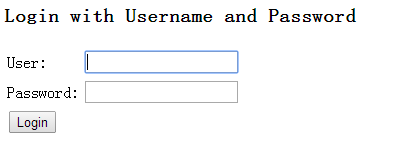

# 初体验

首先我们为 Spring Security 专门建立一个 Spring 的配置文件，该文件就专门用来作为 Spring Security 的配置。使用 Spring Security 我们需要引入 Spring Security 的 NameSpace。

```
<beans xmlns="http://www.springframework.org/schema/beans"
  xmlns:security="http://www.springframework.org/schema/security"
  xmlns:xsi="http://www.w3.org/2001/XMLSchema-instance"
  xsi:schemaLocation="http://www.springframework.org/schema/beans
          http://www.springframework.org/schema/beans/spring-beans-3.1.xsd
          http://www.springframework.org/schema/security
          http://www.springframework.org/schema/security/spring-security-3.1.xsd">
       
</beans>
```

Spring Security 命名空间的引入可以简化我们的开发，它涵盖了大部分 Spring Security 常用的功能。它的设计是基于框架内大范围的依赖的，可以被划分为以下几块。


- Web/Http 安全：这是最复杂的部分。通过建立 filter 和相关的 service bean 来实现框架的认证机制。当访问受保护的 URL 时会将用户引入登录界面或者是错误提示界面。
- 业务对象或者方法的安全：控制方法访问权限的。
- AuthenticationManager：处理来自于框架其他部分的认证请求。
- AccessDecisionManager：为 Web 或方法的安全提供访问决策。会注册一个默认的，但是我们也可以通过普通 bean 注册的方式使用自定义的 AccessDecisionManager。
- AuthenticationProvider：AuthenticationManager 是通过它来认证用户的。
- UserDetailsService：跟 AuthenticationProvider 关系密切，用来获取用户信息的。
 
引入了 Spring Security 的 NameSpace 之后我们就可以使用该命名空间下的元素来配置 Spring Security 了。首先我们来定义一个 http 元素，security 只是我们使用命名空间的一个前缀。http 元素是用于定义 Web 相关权限控制的。

```
   <security:http auto-config="true">
      <security:intercept-url pattern="/**" access="ROLE_USER"/>
   </security:http> 
```

如上定义中，intercept-url 定义了一个权限控制的规则。pattern 属性表示我们将对哪些 url 进行权限控制，其也可以是一个正则表达式，如上的写法表示我们将对所有的 URL 进行权限控制；access 属性表示在请求对应的 URL 时需要什么权限，默认配置时它应该是一个以逗号分隔的角色列表，请求的用户只需拥有其中的一个角色就能成功访问对应的 URL。这里的 “ROLE_USER” 表示请求的用户应当具有 ROLE_USER 角色。“ROLE_” 前缀是一个提示 Spring 使用基于角色的检查的标记。

有了权限控制的规则了后，接下来我们需要定义一个 AuthenticationManager 用于认证。我们先来看如下定义：

```
   <security:authentication-manager>
      <security:authentication-provider>
         <security:user-service>
            <security:user name="user" password="user" authorities="ROLE_USER"/>
            <security:user name="admin" password="admin" authorities="ROLE_USER, ROLE_ADMIN"/>
         </security:user-service>
      </security:authentication-provider>
   </security:authentication-manager>
```

authentication-manager 元素指定了一个 AuthenticationManager，其需要一个 AuthenticationProvider（对应 authentication-provider 元素）来进行真正的认证，默认情况下 authentication-provider 对应一个 DaoAuthenticationProvider，其需要 UserDetailsService（对应 user-service 元素）来获取用户信息 UserDetails（对应 user 元素）。这里我们只是简单的使用 user 元素来定义用户，而实际应用中这些信息通常都是需要从数据库等地方获取的，这个将放到后续再讲。我们可以看到通过 user 元素我们可以指定 user 对应的用户名、密码和拥有的权限。user-service 还支持通过 properties 文件来指定用户信息，如：

```
   <security:user-service properties="/WEB-INF/config/users.properties"/>
```

其中属性文件应遵循如下格式：

```
username=password,grantedAuthority[,grantedAuthority][,enabled|disabled]
```

所以，对应上面的配置文件，我们的 users.properties 文件的内容应该如下所示：

```
#username=password,grantedAuthority[,grantedAuthority][,enabled|disabled]
user=user,ROLE_USER
admin=admin,ROLE_USER,ROLE_ADMIN
```


至此，我们的 Spring Security 配置文件的配置就完成了。完整配置文件将如下所示。

```
<beans xmlns="http://www.springframework.org/schema/beans"
  xmlns:security="http://www.springframework.org/schema/security"
  xmlns:xsi="http://www.w3.org/2001/XMLSchema-instance"
  xsi:schemaLocation="http://www.springframework.org/schema/beans
          http://www.springframework.org/schema/beans/spring-beans-3.1.xsd
          http://www.springframework.org/schema/security
          http://www.springframework.org/schema/security/spring-security-3.1.xsd">
 
   <security:http auto-config="true">
      <security:intercept-url pattern="/**" access="ROLE_USER"/>
   </security:http>    
  
   <security:authentication-manager>
      <security:authentication-provider>
         <security:user-service>
            <security:user name="user" password="user" authorities="ROLE_USER"/>
            <security:user name="admin" password="admin" authorities="ROLE_USER, ROLE_ADMIN"/>
         </security:user-service>
      </security:authentication-provider>
   </security:authentication-manager>
       
</beans>
```

之后我们告诉 Spring 加载这个配置文件。通常，我们可以在 web.xml 文件中通过 context-param 把它指定为 Spring 的初始配置文件，也可以在对应 Spring 的初始配置文件中引入它。这里我们采用前者。

```
   <context-param>
      <param-name>contextConfigLocation</param-name>
   <param-value>/WEB-INF/config/applicationContext.xml,/WEB-INF/config/spring-security.xml</param-value>
   </context-param>
  
   <listener>
   <listener-class>org.springframework.web.context.ContextLoaderListener</listener-class>
   </listener>
```

Spring 的配置文件是通过对应的 ContextLoaderListener 来加载和初始化的，上述代码中的 applicationContext.xml 文件就是对应的 Spring 的配置文件，如果没有可以不用配置。接下来我们还需要在 web.xml 中定义一个 filter 用来拦截需要交给 Spring Security 处理的请求，需要注意的是该 filter 一定要定义在其它如 SpringMVC 等拦截请求之前。这里我们将拦截所有的请求，具体做法如下所示：

```
   <filter>
      <filter-name>springSecurityFilterChain</filter-name>
     <filter-class>org.springframework.web.filter.DelegatingFilterProxy</filter-class>
   </filter>
   <filter-mapping>
      <filter-name>springSecurityFilterChain</filter-name>
      <url-pattern>/*</url-pattern>
   </filter-mapping>
```

接下来可以启动我们的应用，然后在浏览器中访问我们的主页。你会看到如下页面。


 
 
因为我们的 spring-security.xml 文件中配置好了所有的请求都需要 “ROLE_USER” 权限，所以当我们在请求主页的时候，Spring Security 发现我们还没有登录，Spring 会引导我们到登录界面。使用正确的用户名和密码（如上面配置的 user/user 或 admin/admin）登录后，如果符合对应的权限我们就可以访问主页了，否则将出现 403（禁止访问）界面。

可能你会奇怪，我们没有建立上面的登录页面，为什么 Spring Security 会跳到上面的登录页面呢？这是我们设置 http 的 auto-config=”true” 时 Spring Security 自动为我们生成的。

当指定 http 元素的 auto-config=”true” 时，就相当于如下内容的简写。

```
   <security:http>
      <security:form-login/>
      <security:http-basic/>
      <security:logout/>
   </security:http>
```

这些元素负责建立表单登录、基本的认证和登出处理。它们都可以通过指定对应的属性来改变它们的行为。