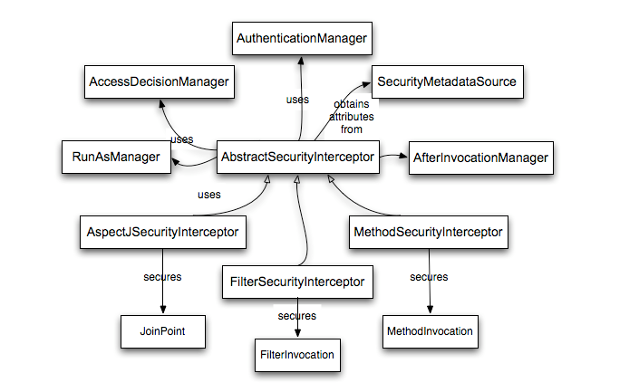

# 权限鉴定基础

Spring Security 的权限鉴定是由 AccessDecisionManager 接口负责的。具体来说是由其中的 decide()方法负责，其定义如下。

```
    void decide(Authentication authentication, Object object, Collection<ConfigAttribute> configAttributes)
        throws AccessDeniedException, InsufficientAuthenticationException;
```

如你所见，该方法接收三个参数，第一个参数是包含当前用户信息的 Authentication 对象；第二个参数表示当前正在请求的受保护的对象，基本上来说是 MethodInvocation（使用 AOP）、JoinPoint（使用 Aspectj）和 FilterInvocation（Web 请求）三种类型；第三个参数表示与当前正在访问的受保护对象的配置属性，如一个角色列表。
 
## Spring Security 的 AOP Advice 思想

对于使用 AOP 而言，我们可以使用几种不同类型的 advice：before、after、throws 和 around。其中 around advice 是非常实用的，通过它我们可以控制是否要执行方法、是否要修改方法的返回值，以及是否要抛出异常。Spring Security 在对方法调用和 Web 请求时也是使用的 around advice 的思想。在方法调用时，可以使用标准的 Spring AOP 来达到 around advice 的效果，而在进行 Web 请求时是通过标准的 Filter 来达到 around advice 的效果。

对于大部分人而言都比较喜欢对 Service 层的方法调用进行权限控制，因为我们的主要业务逻辑都是在 Service 层进行实现的。如果你只是想保护 Service 层的方法，那么使用 Spring AOP 就可以了。如果你需要直接保护领域对象，那么你可以考虑使用 Aspectj。

你可以选择使用 Aspectj 或 Spring AOP 对方法调用进行鉴权，或者选择使用 Filter 对 Web 请求进行鉴权。当然，你也可以选择使用这三种方式的任意组合进行鉴权。通常的做法是使用 Filter 对 Web 请求进行一个比较粗略的鉴权，辅以使用 Spring AOP 对 Service 层的方法进行较细粒度的鉴权。
 
## AbstractSecurityInterceptor

AbstractSecurityInterceptor 是一个实现了对受保护对象的访问进行拦截的抽象类，其中有几个比较重要的方法。beforeInvocation()方法实现了对访问受保护对象的权限校验，内部用到了 AccessDecisionManager 和 AuthenticationManager；finallyInvocation()方法用于实现受保护对象请求完毕后的一些清理工作，主要是如果在 beforeInvocation() 中改变了 SecurityContext，则在 finallyInvocation()中需要将其恢复为原来的 SecurityContext，该方法的调用应当包含在子类请求受保护资源时的 finally 语句块中；afterInvocation()方法实现了对返回结果的处理，在注入了 AfterInvocationManager 的情况下默认会调用其 decide()方法。AbstractSecurityInterceptor 只是提供了这几种方法，并且包含了默认实现，具体怎么调用将由子类负责。每一种受保护对象都拥有继承自 AbstractSecurityInterceptor 的拦截器类，MethodSecurityInterceptor 将用于调用受保护的方法，而 FilterSecurityInterceptor 将用于受保护的 Web 请求。它们在处理受保护对象的请求时都具有一致的逻辑，具体的逻辑如下。

1. 先将正在请求调用的受保护对象传递给 beforeInvocation()方法进行权限鉴定。
2. 权限鉴定失败就直接抛出异常了。
3. 鉴定成功将尝试调用受保护对象，调用完成后，不管是成功调用，还是抛出异常，都将执行 finallyInvocation()。
4. 如果在调用受保护对象后没有抛出异常，则调用 afterInvocation()。
 
以下是 MethodSecurityInterceptor 在进行方法调用的一段核心代码。

```
    public Object invoke(MethodInvocation mi) throws Throwable {
        InterceptorStatusToken token = super.beforeInvocation(mi);
 
        Object result;
        try {
            result = mi.proceed();
        } finally {
            super.finallyInvocation(token);
        }
        returnsuper.afterInvocation(token, result);
    }
```

### ConfigAttribute

AbstractSecurityInterceptor 的 beforeInvocation()方法内部在进行鉴权的时候使用的是注入的 AccessDecisionManager 的 decide() 方法进行的。如前所述，decide()方法是需要接收一个受保护对象对应的 ConfigAttribute 集合的。一个 ConfigAttribute 可能只是一个简单的角色名称，具体将视 AccessDecisionManager 的实现者而定。AbstractSecurityInterceptor 将使用一个 SecurityMetadataSource 对象来获取与受保护对象关联的 ConfigAttribute 集合，具体 SecurityMetadataSource 将由子类实现提供。ConfigAttribute 将通过注解的形式定义在受保护的方法上，或者通过 access 属性定义在受保护的 URL 上。例如我们常见的 <intercept-url pattern=”/**” access=”ROLE\_USER,ROLE\_ADMIN”/> 就表示将 ConfigAttribute ROLE\_USER 和 ROLE\_ADMIN 应用在所有的 URL 请求上。对于默认的 AccessDecisionManager 的实现，上述配置意味着用户所拥有的权限中只要拥有一个 GrantedAuthority 与这两个 ConfigAttribute 中的一个进行匹配则允许进行访问。当然，严格的来说 ConfigAttribute 只是一个简单的配置属性而已，具体的解释将由 AccessDecisionManager 来决定。
 
### RunAsManager

在某些情况下你可能会想替换保存在 SecurityContext 中的 Authentication。这可以通过 RunAsManager 来实现的。在 AbstractSecurityInterceptor 的 beforeInvocation()方法体中，在 AccessDecisionManager 鉴权成功后，将通过 RunAsManager 在现有 Authentication 基础上构建一个新的 Authentication，如果新的 Authentication 不为空则将产生一个新的 SecurityContext，并把新产生的 Authentication 存放在其中。这样在请求受保护资源时从 SecurityContext 中获取到的 Authentication 就是新产生的 Authentication。待请求完成后会在 finallyInvocation()中将原来的 SecurityContext 重新设置给 SecurityContextHolder。AbstractSecurityInterceptor 默认持有的是一个对 RunAsManager 进行空实现的 NullRunAsManager。此外，Spring Security 对 RunAsManager 有一个还有一个非空实现类 RunAsManagerImpl，其在构造新的 Authentication 时是这样的逻辑：如果受保护对象对应的 ConfigAttribute 中拥有以 “RUN\_AS\_” 开头的配置属性，则在该属性前加上 “ROLE\_”，然后再把它作为一个 GrantedAuthority 赋给将要创建的 Authentication（如 ConfigAttribute 中拥有一个 “RUN\_AS\_ADMIN” 的属性，则将构建一个 “ROLE\_RUN\_AS\_ADMIN” 的 GrantedAuthority），最后再利用原 Authentication 的 principal、权限等信息构建一个新的 Authentication 进行返回；如果不存在任何以 “RUN\_AS\_” 开头的 ConfigAttribute，则直接返回 null。RunAsManagerImpl 构建新的 Authentication 的核心代码如下所示。

```
    public Authentication buildRunAs(Authentication authentication, Object object, Collection<ConfigAttribute> attributes) {
        List<GrantedAuthority> newAuthorities = new ArrayList<GrantedAuthority>();
        for (ConfigAttribute attribute : attributes) {
            if (this.supports(attribute)) {
                GrantedAuthority extraAuthority = new SimpleGrantedAuthority(getRolePrefix() + attribute.getAttribute());
                newAuthorities.add(extraAuthority);
            }
        }
        if (newAuthorities.size() == 0) {
            returnnull;
        }
        // Add existing authorities
        newAuthorities.addAll(authentication.getAuthorities());
        returnnew RunAsUserToken(this.key, authentication.getPrincipal(), authentication.getCredentials(),
                newAuthorities, authentication.getClass());
    }
```

### AfterInvocationManager

在请求受保护的对象完成以后，可以通过 afterInvocation() 方法对返回值进行修改。AbstractSecurityInterceptor 把对返回值进行修改的控制权交给其所持有的 AfterInvocationManager 了。AfterInvocationManager 可以选择对返回值进行修改、不修改或抛出异常（如：后置权限鉴定不通过）。
 
以下是 Spring Security 官方文档提供的一张关于 AbstractSecurityInterceptor 相关关系的图。


