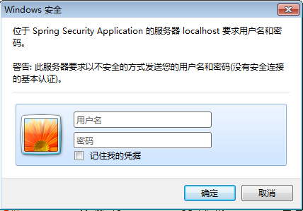

# 关于登录

## form-login 元素介绍

http 元素下的 form-login 元素是用来定义表单登录信息的。当我们什么属性都不指定的时候 Spring Security 会为我们生成一个默认的登录页面。如果不想使用默认的登录页面，我们可以指定自己的登录页面。
 
### 使用自定义登录页面

自定义登录页面是通过 login-page 属性来指定的。提到 login-page 我们不得不提另外几个属性。


- username-parameter：表示登录时用户名使用的是哪个参数，默认是 “j_username”。
- password-parameter：表示登录时密码使用的是哪个参数，默认是 “j_password”。
- login-processing-url：表示登录时提交的地址，默认是 “/j-spring-security-check”。这个只是 Spring Security 用来标记登录页面使用的提交地址，真正关于登录这个请求是不需要用户自己处理的。
 
所以，我们可以通过如下定义使 Spring Security 在需要用户登录时跳转到我们自定义的登录页面。

```
   <security:http auto-config="true">
      <security:form-login login-page="/login.jsp"
         login-processing-url="/login.do" username-parameter="username"
         password-parameter="password" />
      <!-- 表示匿名用户可以访问 -->
      <security:intercept-url pattern="/login.jsp" access="IS_AUTHENTICATED_ANONYMOUSLY"/>
      <security:intercept-url pattern="/**" access="ROLE_USER" />
   </security:http>
```

需要注意的是，我们之前配置的是所有的请求都需要 ROLE\_USER 权限，这意味着我们自定义的 “/login.jsp” 也需要该权限，这样就会形成一个死循环了。解决办法是我们需要给 “/login.jsp” 放行。通过指定 “/login.jsp” 的访问权限为 “IS\_AUTHENTICATED_ANONYMOUSLY” 或 “ROLE\_ANONYMOUS” 可以达到这一效果。此外，我们也可以通过指定一个 http 元素的安全性为 none 来达到相同的效果。如：

```
   <security:http security="none" pattern="/login.jsp" />
   <security:http auto-config="true">
      <security:form-login login-page="/login.jsp"
         login-processing-url="/login.do" username-parameter="username"
         password-parameter="password" />
      <security:intercept-url pattern="/**" access="ROLE_USER" />
   </security:http>
```

它们两者的区别是前者将进入 Spring Security 定义的一系列用于安全控制的 filter，而后者不会。当指定一个 http 元素的 security 属性为 none 时，表示其对应 pattern 的 filter 链为空。从 3.1 开始，Spring Security 允许我们定义多个 http 元素以满足针对不同的 pattern 请求使用不能的 filter 链。当为指定 pattern 属性时表示对应的 http 元素定义将对所有的请求发生作用。
 
根据上面的配置，我们自定义的登录页面的内容应该是这样子的：

```
   <form action="login.do" method="post">
      <table>
         <tr>
            <td> 用户名：</td>
            <td><input type="text" name="username"/></td>
         </tr>
         <tr>
            <td> 密码：</td>
            <td><input type="password" name="password"/></td>
         </tr>
         <tr>
            <td colspan="2" align="center">
                <input type="submit" value=" 登录 "/>
                <input type="reset" value=" 重置 "/>
            </td>
         </tr>
      </table>
   </form>
```

### 指定登录后的页面

#### 通过 default-target-url 指定

默认情况下，我们在登录成功后会返回到原本受限制的页面。但如果用户是直接请求登录页面，登录成功后应该跳转到哪里呢？默认情况下它会跳转到当前应用的根路径，即欢迎页面。通过指定 form-login 元素的 default-target-url 属性，我们可以让用户在直接登录后跳转到指定的页面。如果想让用户不管是直接请求登录页面，还是通过 Spring Security 引导过来的，登录之后都跳转到指定的页面，我们可以通过指定 form-login 元素的 always-use-default-target 属性为 true 来达到这一效果。
 
#### 通过 authentication-success-handler-ref 指定

authentication-success-handler-ref 对应一个 AuthencticationSuccessHandler 实现类的引用。如果指定了 authentication-success-handler-ref，登录认证成功后会调用指定 AuthenticationSuccessHandler 的 onAuthenticationSuccess 方法。我们需要在该方法体内对认证成功做一个处理，然后返回对应的认证成功页面。使用了 authentication-success-handler-ref 之后认证成功后的处理就由指定的 AuthenticationSuccessHandler 来处理，之前的那些 default-target-url 之类的就都不起作用了。

以下是自定义的一个 AuthenticationSuccessHandler 的实现类。

```
publicclass AuthenticationSuccessHandlerImpl implements
      AuthenticationSuccessHandler {
 
   publicvoid onAuthenticationSuccess(HttpServletRequest request,
         HttpServletResponse response, Authentication authentication)
         throws IOException, ServletException {
      response.sendRedirect(request.getContextPath());
   }
 
}
```

其对应使用 authentication-success-handler-ref 属性的配置是这样的：

```
   <security:http auto-config="true">
      <security:form-login login-page="/login.jsp"
         login-processing-url="/login.do" username-parameter="username"
         password-parameter="password"
         authentication-success-handler-ref="authSuccess"/>
      <!-- 表示匿名用户可以访问 -->
      <security:intercept-url pattern="/login.jsp"
         access="IS_AUTHENTICATED_ANONYMOUSLY" />
      <security:intercept-url pattern="/**" access="ROLE_USER" />
   </security:http>
   <!-- 认证成功后的处理类 -->
   <bean id="authSuccess" class="com.xxx.AuthenticationSuccessHandlerImpl"/>
```

### 指定登录失败后的页面

除了可以指定登录认证成功后的页面和对应的 AuthenticationSuccessHandler 之外，form-login 同样允许我们指定认证失败后的页面和对应认证失败后的处理器 AuthenticationFailureHandler。

#### 通过 authentication-failure-url 指定

默认情况下登录失败后会返回登录页面，我们也可以通过 form-login 元素的 authentication-failure-url 来指定登录失败后的页面。需要注意的是登录失败后的页面跟登录页面一样也是需要配置成在未登录的情况下可以访问，否则登录失败后请求失败页面时又会被 Spring Security 重定向到登录页面。

```
   <security:http auto-config="true">
      <security:form-login login-page="/login.jsp"
         login-processing-url="/login.do" username-parameter="username"
         password-parameter="password"
         authentication-failure-url="/login_failure.jsp"
         />
      <!-- 表示匿名用户可以访问 -->
      <security:intercept-url pattern="/login*.jsp*"
         access="IS_AUTHENTICATED_ANONYMOUSLY" />
      <security:intercept-url pattern="/**" access="ROLE_USER" />
   </security:http>
```

#### 通过 authentication-failure-handler-ref 指定

类似于 authentication-success-handler-ref，authentication-failure-handler-ref 对应一个用于处理认证失败的 AuthenticationFailureHandler 实现类。指定了该属性，Spring Security 在认证失败后会调用指定 AuthenticationFailureHandler 的 onAuthenticationFailure 方法对认证失败进行处理，此时 authentication-failure-url 属性将不再发生作用。
 
## http-basic

之前介绍的都是基于 form-login 的表单登录，其实 Spring Security 还支持弹窗进行认证。通过定义 http 元素下的 http-basic 元素可以达到这一效果。

```
   <security:http auto-config="true">
      <security:http-basic/>
      <security:intercept-url pattern="/**" access="ROLE_USER" />
   </security:http>
```
    
此时，如果我们访问受 Spring Security 保护的资源时，系统将会弹出一个窗口来要求我们进行登录认证。效果如下：


 
当然此时我们的表单登录也还是可以使用的，只不过当我们访问受包含资源的时候 Spring Security 不会自动跳转到登录页面。这就需要我们自己去请求登录页面进行登录。

需要注意的是当我们同时定义了 http-basic 和 form-login 元素时，form-login 将具有更高的优先级。即在需要认证的时候 Spring Security 将引导我们到登录页面，而不是弹出一个窗口。